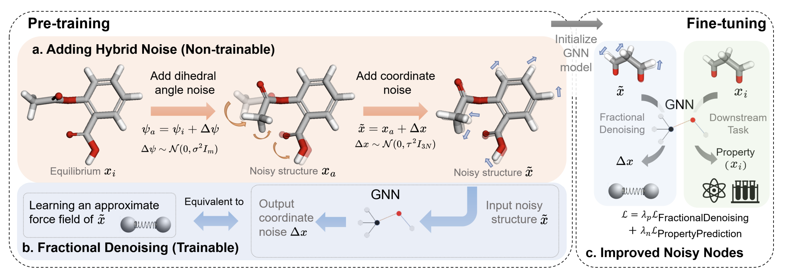

# Frad
This repository contains the official implementation of the paper titled "Fractional Denoising for 3D Molecular Pre-training," accepted by ICML23.




# Fine-Tuning

## Pre-trained Models

The pre-trained models can be accessed via the following links:

- For QM9: [Download Link](https://drive.google.com/file/d/1O6f6FzYogBS2Mp4XsdAAEN4arLtLH38G/view?usp=share_link)

- For MD17: [Download Link](https://drive.google.com/file/d/19slj94zSjOsNDYagwYfxfrsylRuwx3Hp/view?usp=share_link)

## Finetune on QM9

Below is the script for fine-tuning the QM9 task. Ensure to replace `pretrain_model_path` with the actual model path. In this script, the subtask is set to 'homo', but it can be replaced with other subtasks as well.

```bash
python -u scripts/train.py --conf examples/ET-QM9-FT_dw_0.2_long.yaml --layernorm-on-vec whitened --job-id frad_homo --dataset-arg homo  --denoising-weight 0.1 --dataset-root $datapath --pretrained-model $pretrain_model_path
```


## Finetune on MD17
Below is the script for fine-tuning the MD17 task. Replace pretrain_model_path with the actual model path. In this script, the subtask is set to 'aspirin', but it can be replaced with other subtasks such as {'benzene', 'ethanol', 'malonaldehyde', 'naphthalene', 'salicylic_acid', 'toluene', 'uracil'}.


```bash
python -u scripts/train.py --conf examples/ET-MD17_FT-angle_9500.yaml  --job-id frad_aspirin --dataset-arg aspirin --pretrained-model $pretrain_model_path --dihedral-angle-noise-scale 20 --position-noise-scale 0.005 --composition true --sep-noisy-node true --train-loss-type smooth_l1_loss
```


